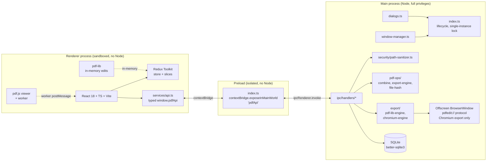
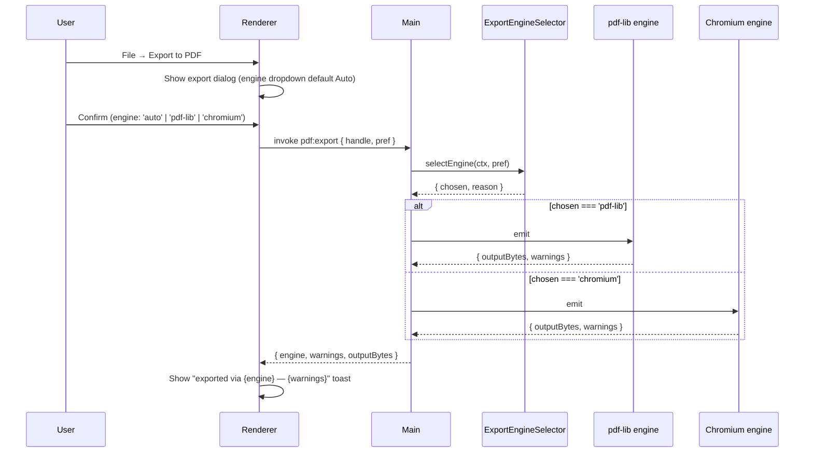

# ARCHITECTURE — PDF_Viewer_Editor

**Author:** Riley (front-end-architect), via Marcus orchestration
**Date:** 2026-05-21
**Status:** Wave 1 architecture, locked. Encodes user decisions from `docs/project-plan.md` §5.
**Scope:** End-to-end architecture sufficient for Wave 2 implementation, Wave 3 packaging + review, and Wave 4 documentation. Phase 2–7 extension points are called out but not detailed.

---

## 1. Process model (Electron multi-process)



### 1.1 Process responsibilities

| Process | Privileges | Owns | Forbidden |
|---|---|---|---|
| **Main** | Full Node, FS, native dialogs, SQLite, child processes | App lifecycle, window mgmt, all FS I/O, SQLite, native dialogs, IPC handlers, path sanitization, file hashing, server-side pdf-lib operations (combine, export), offscreen Chromium export window | DOM, React, no UI rendering except via BrowserWindow |
| **Preload** | Node only via whitelist; `contextBridge` exposes typed API | Surface ONLY the typed `pdfApi` (no raw `ipcRenderer`, no `require`, no `process`) | Reading FS directly, business logic, state management |
| **Renderer** | DOM, no Node, `sandbox: true`, isolated context | React UI, Redux store, pdf.js render pipeline, in-memory pdf-lib edits, annotation authoring | Direct FS access, direct SQLite, `require('electron')`, anything not on `window.pdfApi` |

### 1.2 Module boundary rules

1. Renderer never knows a file path string outside of `display_name` for UI. The renderer holds a document **handle** (opaque integer or UUID) returned by `dialog:openPdf` / `fs:readPdf`; subsequent operations on that document pass the handle, not the path.
2. Preload is a **shim, not a library**. It re-exports `ipcRenderer.invoke('channel', payload)` typed against `src/ipc/contracts.ts`. No transformation, no validation. Validation happens in the main-process handler.
3. Main never invokes the renderer except via `webContents.send` for streaming events (e.g. `pdf:export:progress`). Renderer→main is always `invoke` (request/response). Main→renderer is always `send` (fire-and-forget event).
4. Heavy CPU operations (combine, export, file-hash) run in **main**, not renderer. The renderer stays responsive.
5. The offscreen BrowserWindow used by the Chromium export engine is **created on demand**, lives only for the export, and is destroyed after the PDF buffer is captured. It is NEVER reused for general rendering.

---

## 2. Security model

### 2.1 BrowserWindow configuration (non-negotiable)

```ts
new BrowserWindow({
  webPreferences: {
    contextIsolation: true,        // mandatory
    nodeIntegration: false,         // mandatory
    nodeIntegrationInWorker: false, // mandatory
    nodeIntegrationInSubFrames: false,
    sandbox: true,                  // mandatory for the main viewer window
    webSecurity: true,
    allowRunningInsecureContent: false,
    preload: path.join(__dirname, '../preload/index.js'),
    // NO `enableRemoteModule` — removed in Electron 14+, do not re-enable
  },
});
```

The **offscreen export window** (Chromium engine only) uses identical settings except it loads via the `pdfedit://` custom protocol (see §6.3) and never executes user-supplied JS.

### 2.2 Content Security Policy

Set in main process via `session.defaultSession.webRequest.onHeadersReceived`. Mirrored as a `<meta http-equiv="Content-Security-Policy">` in `src/client/index.html`.

```
default-src 'self';
script-src 'self';
style-src 'self' 'unsafe-inline';
font-src 'self' data:;
img-src 'self' data: blob:;
worker-src 'self' blob:;
connect-src 'self';
object-src 'none';
frame-src 'none';
base-uri 'self';
form-action 'none';
```

Notes:
- `style-src 'unsafe-inline'` is required by some React patterns; revisit in Phase 7 after audit.
- `worker-src 'self' blob:` is required by pdf.js — it instantiates its worker from a blob URL.
- `img-src ... blob:` is required because pdf.js renders pages to canvas, then to blob URLs for thumbnails.
- No `unsafe-eval`. No remote origins of any kind.

### 2.3 IPC surface contract

- Every channel listed in `docs/api-contracts.md` is typed end-to-end (`src/ipc/contracts.ts`, David's file).
- Preload exposes ONLY the typed `pdfApi` object — no `ipcRenderer`, no `process`, no `require`.
- Every main-process handler:
  - Validates input shape (Zod or hand-written guards — David picks; Riley specs the contract types)
  - Sanitizes any path arg through `src/main/security/path-sanitizer.ts`
  - Returns a discriminated-union `Result<T, ErrorVariant>` — never throws across the bridge
  - Logs the channel name + duration (no payloads — those can contain document content)

### 2.4 File-system access policy

- Renderer NEVER sees raw paths from disk dialogs without sanitization (path-sanitizer normalizes, rejects `..` traversal, validates extension).
- The renderer receives only what it needs to display: `display_name`, `file_hash`, and the opaque document `handle`. Full paths stay in main.
- Recent-files menu shows display names; clicking re-opens via handle lookup in main.

### 2.5 Renderer-attack-surface checklist

- No `dangerouslySetInnerHTML` except for sanitized PDF outline labels (and those go through a sanitizer first)
- No `eval`, no `new Function(...)`, no `setTimeout(string)` — ESLint rule `no-eval`, `no-implied-eval`
- No CDN loads (CSP enforces)
- Annotation text input is treated as plain text; if rich text is added in Phase 2, it goes through a sanitizer before being written to the PDF FreeText annotation

---

## 3. Library inventory

All licenses verified 2026-05-21. Versions are latest stable as of that date; lock to exact versions in `package.json`.

| Library | Version | License | Process(es) | Purpose |
|---|---|---|---|---|
| `electron` | 30.x | MIT | Main, Preload, Renderer (shell) | Desktop shell |
| `react` | 18.3.x | MIT | Renderer | UI |
| `react-dom` | 18.3.x | MIT | Renderer | UI |
| `typescript` | 5.4.x | Apache-2.0 | Build | Type system |
| `pdfjs-dist` | 4.4.x | Apache-2.0 | Renderer | PDF rendering |
| `pdf-lib` | 1.17.x | MIT | Main + Renderer | PDF editing, page ops, combine, export-engine A |
| `better-sqlite3` | 11.x | MIT | Main | Embedded SQLite (synchronous, faster than `sqlite3`) |
| `@reduxjs/toolkit` | 2.2.x | MIT | Renderer | State management (Decision 3) |
| `react-redux` | 9.x | MIT | Renderer | React bindings for Redux |
| `immer` | 10.x | MIT | Renderer | Bundled with RTK; mutable-style reducers |
| `reselect` | 5.x | MIT | Renderer | Memoized selectors (bundled with RTK) |
| `@dnd-kit/core` | 6.x | MIT | Renderer | Drag-drop for thumbnails |
| `@dnd-kit/sortable` | 8.x | MIT | Renderer | Sortable list for thumbnail reorder |
| `zod` | 3.23.x | MIT | Main + Renderer (shared) | IPC payload validation |
| `vite` | 5.x | MIT | Build | Renderer bundler |
| `electron-vite` | 2.x | MIT | Build | Multi-process Vite orchestration |
| `electron-builder` | 24.x | MIT | Build | Windows MSI + portable .exe packaging |
| `vitest` | 1.6.x | MIT | Tests | Unit tests |
| `@playwright/test` | 1.44.x | Apache-2.0 | Tests | E2E (Electron) smoke |
| `eslint` | 8.x | MIT | Build | Linting |
| `@typescript-eslint/eslint-plugin` | 7.x | MIT/BSD | Build | TS lint rules |
| `prettier` | 3.x | MIT | Build | Formatting |

**Explicitly excluded (license policy from `CLAUDE.md`):**
- PyMuPDF (AGPL)
- iText (AGPL)
- Ghostscript (AGPL)
- PDFTron / Apryse (commercial)
- Foxit, Syncfusion (commercial)

**Phase-2+ libraries (not added in Wave 2, listed here so the architecture leaves room):**
- `tesseract.js` (Apache-2.0) — OCR, Phase 5
- `docx`, `exceljs`, `pptxgenjs` (MIT) — Office export, Phase 6

Every new dependency added later MUST have its license re-verified by Julian in the next code review.

---

## 4. Document model (in-memory)

The document model is the single source of truth for "what the user sees and is editing." It lives in the renderer's Redux store (`documentSlice`) and is reified into a real PDF by pdf-lib on save / export.

### 4.1 Core types (TS, normative — full definitions in `docs/data-models.md`)

```ts
type DocumentHandle = number; // opaque, assigned by main process on open

interface PDFDocumentModel {
  handle: DocumentHandle;
  displayName: string;       // filename without path
  fileHash: string;          // SHA-256 of (first 64 KiB + file size), hex
  pageCount: number;
  pages: PageModel[];        // length === pageCount post-edit
  annotations: AnnotationModel[]; // all pages, indexed by pageIndex on each
  dirtyOps: EditOperation[]; // unsaved operations in order
  savedAtHandleVersion: number; // increments on save; used to detect "unsaved changes"
}

interface PageModel {
  pageIndex: number;       // current ordinal in document; mutates with reorder
  sourcePageRef: SourcePageRef; // points back to where this page came from
  rotation: 0 | 90 | 180 | 270;
  width: number; height: number; // PDF user-space units
}

type SourcePageRef =
  | { kind: 'original'; originalIndex: number }              // from the loaded PDF
  | { kind: 'inserted'; sourceFileHash: string; sourcePageIndex: number } // from another PDF inserted via combine
  | { kind: 'blank'; width: number; height: number };        // blank page inserted

interface AnnotationModel {
  id: string;              // UUID; stable across edits
  pageIndex: number;       // current page; mutates with reorder
  subtype: AnnotationSubtype; // see data-models.md
  // ... subtype-specific fields (rects, points, contents, color, opacity)
  pdfObjectNumber?: number; // present once written to PDF; absent for new
  dirty: boolean;          // since last save
}

type EditOperation =
  | { kind: 'reorder';      meta: EditMeta; fromIndex: number; toIndex: number }
  | { kind: 'insert';       meta: EditMeta; atIndex: number; source: SourcePageRef }
  | { kind: 'delete';       meta: EditMeta; pageIndex: number }
  | { kind: 'rotate';       meta: EditMeta; pageIndex: number; rotation: 0|90|180|270 }
  | { kind: 'annot-add';    meta: EditMeta; annotation: AnnotationModel }
  | { kind: 'annot-edit';   meta: EditMeta; id: string; patch: Partial<AnnotationModel> }
  | { kind: 'annot-delete'; meta: EditMeta; id: string };

interface EditMeta {
  ts: number;      // ms epoch
  undoable: true;  // every EditOperation is undoable; non-undoable changes don't go through this union
}
```

### 4.2 Why a discriminated union for EditOperation

- **Serializable.** Every op is plain data; the dirtyOps list IS the redo log.
- **Replayable.** `applyOps(originalBytes, ops[]) → newBytes` is a pure function in `src/main/pdf-ops/replay.ts` (David's file). This is the Decision 1 / pdf-lib engine.
- **Undoable.** Every op has its inverse computed on push (e.g. `delete` → `insert at same index with same source`). The history middleware (§5.3) pushes onto the past stack.
- **Auditable.** Julian can verify in code review that every UI mutation goes through an EditOperation.

### 4.3 Dirty-state tracking

`dirtyOps[]` length > 0 ⇒ unsaved changes. UI shows the "modified" indicator in the title bar and prompts on close.
On successful save:
- `dirtyOps[]` is cleared
- `savedAtHandleVersion` increments
- Annotations newly written acquire their `pdfObjectNumber` and clear their `dirty` flag

### 4.4 Memory hygiene (pdf.js)

- Every `PDFPageProxy` obtained via `pdfDoc.getPage(n)` MUST have `.cleanup()` called when the page is scrolled out of viewport + sidebar visibility
- Every `RenderTask` MUST be cancelled on component unmount and on rapid re-render
- The pdf.js worker is instantiated once per document and torn down on close
- Riley's `src/client/services/pdf-render.ts` wraps these contracts; Julian audits in Wave 3

---

## 5. State architecture (Redux Toolkit)

Decision 3 (locked 2026-05-21): Redux Toolkit, NOT Zustand. Rationale in `docs/project-plan.md` §5.

### 5.1 Slice inventory (Phase 1)

| Slice | Purpose | Selectors of note |
|---|---|---|
| `documentSlice` | The open PDF model (§4.1). One open document for Phase 1; designed for multi-doc later. | `selectCurrentDocument`, `selectDirtyOps`, `selectIsDirty`, `selectPage(pageIndex)` |
| `viewportSlice` | Zoom level, scroll position, current page, fit mode | `selectZoom`, `selectFitMode`, `selectCurrentPage` |
| `annotationsSlice` | Active tool, draft annotation in-progress (before commit), tool defaults (color, opacity) | `selectActiveTool`, `selectDraftAnnotation` |
| `selectionSlice` | Selected thumbnails / pages for batch ops | `selectSelectedPageIndices` |
| `exportSlice` | Engine choice for current export, in-flight job state, warnings | `selectExportEngine`, `selectExportProgress` |
| `uiSlice` | Sidebar tab, modal open, error banner, recents-menu state | `selectSidebarTab`, `selectActiveModal` |
| `recentsSlice` | Recent files list (mirror of SQLite, populated on app start) | `selectRecents` |
| `bookmarksSlice` | User-authored bookmarks for the open document | `selectBookmarks` |

Phase 2 adds:
- `historySlice` — `past: Action[]; present: DocumentSnapshot; future: Action[]`. Designed in `historySlice.ts` already in Phase 1 with skeleton; activated in Phase 2.

### 5.2 Conventions

(Full text in `docs/conventions.md` §6.)

- One file per slice: `src/client/state/slices/<name>-slice.ts`
- Selectors next to slice: `src/client/state/slices/<name>-selectors.ts`. Memoize with `createSelector` when derived.
- Async work via `createAsyncThunk`. The IPC call IS the thunk payload: `openDocumentThunk` → `window.pdfApi.dialog.openPdf()` → dispatches `documentSlice/setDocument`.
- Typed hooks: `useAppSelector` / `useAppDispatch` from `src/client/state/hooks.ts`. Components never use raw `useSelector` / `useDispatch`.
- No `redux-saga`, no `redux-observable`. Thunks only.
- No RTK Query (no server cache to manage).
- Strict types: `RootState = ReturnType<typeof store.getState>`, `AppDispatch = typeof store.dispatch`.

### 5.3 Command-pattern undo/redo middleware

```
Action dispatched
   ↓
[historyMiddleware]
   ↓
  is action.meta?.undoable === true?
     ├─ yes → compute inverse(action, prevState) → push { fwd, inv } onto past stack
     │        if past.length > MAX_HISTORY (default 100), drop oldest
     ↓
   pass to next reducer
```

- Each `EditOperation`-bearing action carries `meta: { undoable: true }`
- Inverse computation lives next to the reducer (`documentSlice.inverses.ts`)
- Undo dispatches the stored inverse + moves the entry to the future stack
- Redo dispatches the stored forward + moves it back to past
- Phase 1 includes the middleware infrastructure; Phase 2 wires the actual UI buttons / shortcuts

Reasoning: the same `EditOperation` union that drives pdf-lib replay (§4.2 / §6) also drives undo. One data type, two consumers.

---

## 6. Print-to-PDF dual-engine design (Decision 1)

**Locked 2026-05-21:** Hybrid. pdf-lib re-emit is default; headless Chromium `printToPDF()` is the fallback. Both engines designed in from day one. Decision point in the export flow with a heuristic + manual override.

### 6.1 ExportEngineSelector

```ts
type ExportEngine = 'pdf-lib' | 'chromium';
type ExportEnginePreference = 'auto' | ExportEngine;

interface ExportContext {
  document: PDFDocumentModel;
  originalBytes: Uint8Array;
  originalLoadWarnings: string[]; // populated by pdf-lib on initial load
  annotationSubtypesInUse: AnnotationSubtype[];
}

interface EngineSelection {
  chosen: ExportEngine;
  reason: string;       // human-readable, surfaced in export dialog warnings
  forcedBy?: 'user' | 'heuristic';
}

function selectEngine(ctx: ExportContext, pref: ExportEnginePreference): EngineSelection {
  if (pref !== 'auto') return { chosen: pref, reason: `manual override: ${pref}`, forcedBy: 'user' };
  // Heuristic — fail safe to Chromium when in doubt
  if (ctx.document.fileHash && isEncryptedSource(ctx.originalBytes))
    return { chosen: 'chromium', reason: 'source PDF is encrypted; pdf-lib round-trip may corrupt', forcedBy: 'heuristic' };
  if (ctx.originalLoadWarnings.some(w => /xref|object stream|repair/i.test(w)))
    return { chosen: 'chromium', reason: 'pdf-lib reported structural warnings on load', forcedBy: 'heuristic' };
  if (hasCMYKWithICC(ctx.originalBytes))
    return { chosen: 'chromium', reason: 'CMYK + ICC color management not preserved by pdf-lib', forcedBy: 'heuristic' };
  if (ctx.annotationSubtypesInUse.some(s => UNAUTHORABLE_BY_PDFLIB.includes(s)))
    return { chosen: 'chromium', reason: 'document contains annotation subtypes pdf-lib cannot author cleanly', forcedBy: 'heuristic' };
  return { chosen: 'pdf-lib', reason: 'default engine', forcedBy: 'heuristic' };
}

const UNAUTHORABLE_BY_PDFLIB: AnnotationSubtype[] = ['Ink']; // freehand; manual dict authoring still possible but flagged
```

Heuristic signals (initial; refine in Phase 2 based on telemetry):
1. **Encrypted source** — even with print-permission, pdf-lib's save can drop the security handler or fail
2. **xref repair triggered** — the source PDF is malformed-but-viewable; pdf-lib's save may produce an unreadable file
3. **CMYK + embedded ICC profile** — pdf-lib's color path is sRGB-biased
4. **Annotation subtype pdf-lib cannot author cleanly** — Ink (freehand) is the current case; promotable to a list as we discover others
5. **User manual override** wins over heuristic in either direction

### 6.2 Engine A: pdf-lib re-emit

```
src/main/export/pdf-lib-engine.ts (David's file, Phase 2)
   input:  { originalBytes, ops: EditOperation[], annotations: AnnotationModel[] }
   output: { outputBytes: Uint8Array, warnings: string[] }
   steps:
     1. PDFDocument.load(originalBytes, { updateMetadata: false, ignoreEncryption: false })
     2. for op of ops: apply (reorder/insert/delete/rotate via copyPages/removePage/insertPage)
     3. for annotation of dirtyAnnotations: write via page.node.set(PDFName.of('Annots'), ...)
     4. save({ useObjectStreams: true, addDefaultPage: false }) → outputBytes
```

Pure function over `(originalBytes, ops, annotations)`. Same input ⇒ same output. Testable via Vitest with golden files.

### 6.3 Engine B: Chromium `printToPDF()`

```
src/main/export/chromium-engine.ts (David's file, Phase 2)
   input:  { document: PDFDocumentModel, originalBytes: Uint8Array, annotations: AnnotationModel[] }
   output: { outputBytes: Uint8Array, warnings: string[] }
   steps:
     1. Register a one-shot custom protocol pdfedit:// that serves the in-memory edited PDF bytes
        (built by applying ops to originalBytes with pdf-lib; even if pdf-lib's save corrupts some structures,
         Chromium re-parses tolerantly)
     2. Create offscreen BrowserWindow (show: false, webPreferences sandboxed)
     3. Load pdfedit://current-document
     4. Wait for did-finish-load + pdf.js worker ready event (renderer-side)
     5. Call webContents.printToPDF({ printBackground: true, pageSize: A4 | original, marginsType: 0 })
     6. Return the buffer; destroy the offscreen window
   notes:
     - NO temp file on disk — pdfedit:// protocol streams bytes from memory
     - Offscreen window lives only for the duration of one export
     - Renderer in offscreen window is the SAME React app, but with a /export-render route
       that auto-loads the document and signals ready
```

**Why this is acceptable security-wise:** the offscreen window uses identical sandboxing as the main viewer; the only delta is the `pdfedit://` protocol, which serves bytes that ALREADY came from the user's document (no external input).

### 6.4 Decision point in export flow



The IPC channel `pdf:export` (specified in `docs/api-contracts.md`) returns `{ engine, warnings, outputBytes }` so the UI can surface which engine actually ran.

---

## 7. Annotation architecture (Decision 2)

**Locked 2026-05-21:** Embed as standard ISO 32000 PDF annotation subtypes. No sidecar.

### 7.1 Subtype mapping (full table in `docs/data-models.md` §3)

Phase 1 ships: `/Highlight`, `/Text` (sticky note), `/FreeText` (text box).
Phase 2 adds: `/Underline`, `/StrikeOut`, `/Ink` (freehand).
Phase 4 adds: `/Square`, `/Circle`, `/Line`.

### 7.2 Round-trip

```
On open:
  pdf-lib loads → for each page, read /Annots array → parse known subtypes → push into annotationsSlice
  Unknown subtypes are preserved verbatim (raw PDF dict stored in annotation.preservedDict) and
  shown as read-only "third-party annotation" markers in the UI.

On save:
  for each AnnotationModel with dirty === true:
    if subtype is pdf-lib-native: page.node.addAnnot(...)
    if subtype is /Ink (or other manual): hand-author PDFDict { Subtype, Rect, InkList, BS, C, ... }
  Annotations not modified since open: leave untouched in the source PDF.
```

### 7.3 Coordinate system note

PDF y-axis is bottom-up; the screen y-axis is top-down. The conversion lives in **one place**: `src/client/services/pdf-coords.ts` (Riley's file). Every annotation read/write goes through it. Julian audits.

### 7.4 No sidecar — implication for Phase 4

When measure / callout annotations (Phase 4) need data pdf-lib cannot represent natively, the resolution is:
1. Author the annotation dict manually using `PDFDict` / `PDFArray` (the path used by Ink in Phase 2), OR
2. Mark the document for the Chromium export engine on save (Decision 1 path B), so the visual is preserved even if the dict isn't a perfect standard annotation

Sidecar JSON files are explicitly off the table per Decision 2.

---

## 8. Extension points for Phase 2–7

Phase 1 architects these slots so later phases plug in without ripping anything out.

| Phase | Feature | Extension point |
|---|---|---|
| 2 | Image import as page | `EditOperation` adds variant `{ kind: 'insert'; source: { kind: 'image'; bytes, ... } }`. `pdf-lib-engine` handles via `embedPng` / `embedJpg`. |
| 2 | Text editing on existing pages | `EditOperation` adds `{ kind: 'text-edit'; pageIndex; objectId; newText }`. pdf-lib path requires content-stream parsing — Riley will spec when Phase 2 opens. |
| 2 | Print to physical printer | Reuses Chromium export engine into `webContents.print()` instead of `printToPDF()`. Channel `pdf:print` mirrors `pdf:export`. |
| 2 | Undo/redo UI | `historySlice` skeleton already present; Phase 2 wires UI + shortcuts (Ctrl+Z/Y). |
| 3 | AcroForms | Renderer renders form fields as React components overlaid on canvas. `documentSlice` gains `formFields: FormField[]`. New IPC channel `forms:list`, `forms:fillBatch`. |
| 3 | Mail merge | Main-process CSV/XLSX parser feeds `forms:fillBatch` in a loop. No renderer involvement except the wizard UI. |
| 4 | Signature capture | New slice `signaturesSlice` + renderer canvas component. Placement is an `EditOperation { kind: 'sign'; ... }`. |
| 4 | Full annotation toolset | New subtypes added to the AnnotationSubtype union; ExportEngineSelector heuristic updated. |
| 5 | Scan (TWAIN) | Main-process native helper (separate process spawned via Node child_process). New IPC channel `scan:start`, streams pages via `webContents.send`. |
| 5 | OCR | Main-process worker using `tesseract.js` (or native Tesseract); produces searchable PDF layer. New `EditOperation { kind: 'ocr-overlay'; pageIndex; ... }`. |
| 6 | Office export | New IPC channel `export:office { format: 'docx'\|'xlsx'\|'pptx'\|'png'\|'jpg'\|'tiff' }`. Main-process libraries (`docx`, `exceljs`, `pptxgenjs`). |
| 7 | Auto-update | `electron-updater` integration in main process; opt-in setting in `app_settings`. |
| 7 | Telemetry | Opt-in only; anonymous; shipped to a TBD endpoint (not in scope to wire here). |
| 7 | macOS / Linux | electron-builder config gains `dmg` and `AppImage` targets; native dialogs already cross-platform. |

---

## 9. Build / packaging boundary

Wave 1 specifies; **Diego owns the implementation in Wave 3** (per project-plan §2.3.1). Architecture commitments:

- Two build targets per platform: `dev` (Vite HMR + electron-vite) and `build` (production bundles + electron-builder)
- Renderer bundled with Vite; main + preload bundled with esbuild (driven by electron-vite)
- Source maps off in production renderer (security)
- electron-builder produces NSIS installer (.exe) AND portable .exe from the same build
- Code-signing: Phase 7, placeholder config only
- Auto-update: Phase 7, placeholder config only

---

## 10. Testing strategy

| Layer | Tool | Scope (Phase 1) |
|---|---|---|
| Unit (pure logic) | Vitest | EditOperation reducers, ExportEngineSelector heuristic, path-sanitizer, pdf-coords conversion |
| Unit (Redux slices) | Vitest + RTK test utils | Each slice's reducer + selectors |
| E2E (smoke) | Playwright (Electron) | Launch app → open `tests/fixtures/sample.pdf` → screenshot → exit |
| Manual / operator | `operator` skill | Wave 4 (Nathan) captures real screenshots for README + user guide |

Targets:
- Unit coverage ≥ 70% on pure logic files (Wave 3 quality gate)
- E2E smoke green on a clean Windows checkout
- No flaky tests merged (Julian enforces)

---

## 11. Open architectural questions

These are NOT blocking Wave 2 dispatch but should be resolved during Wave 2 / 3:

1. **CSP `style-src 'unsafe-inline'`** — required by some React patterns and possibly by pdf.js. Confirm during Wave 2 build whether it can be tightened to `'self'` only.
2. **Document handle lifecycle** — when the user closes a document, when does main release the in-memory bytes? Decision: on `dialog:closePdf` or app quit. Specify lifecycle exactly in `docs/api-contracts.md`.
3. **Annotation `pdfObjectNumber` collision on reorder** — when a page is reordered, the PDF object number doesn't change but the page index does. Annotation rebinding lives in `documentSlice`; verify in code review (Julian).
4. **pdf.js worker count** — one worker per document, or one shared? Phase 1 has only one open doc; defer to Phase 2 multi-doc.
